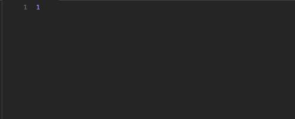

# Ecommerce-Back-End

## Description 

This web application is a backend service that uses Node.js, Express, Sequelize and dotenv to provide routes to a front-end interface while accessing data stored in a MySQL database. The system is designed to help developers build powerful and efficient applications with ease. It provides robust tools such as user authentication, authorization, password encryption, and more, allowing users to quickly create secure and reliable applications without the need for extensive coding. Additionally, its use of dotenv ensures that application deployment is quick and smooth.
 
## Table of Contents 


* [Installation](#installation)
* [Usage](#usage)
* [Credits](#credits)
* [License](#license)


## Installation

**Install or open the Vs Code.**

*  **Run CLI**

```CLI-step 1
npm i
```

```CLI-step 2
mysql -u root -p
```

```CLI-step 3 
source ./db/schema.sql
```

```CLI-step 4
 npm run seed 
 ```

 ```CLI-step 5
 npm start
 ```   

```CLI-step 6
node server.js
```

# Usage 

## Click Link below:

[Walkthrought video](https://youtu.be/RbqyQjj5uEo)

## Images

### Products

  

<br/>
<br/>

### Category


### Post


### Delete



### After Delete


## License
[](https://opensource.org/licenses/MIT)


## Credits
 - 


## Badges


[](https://www.npmjs.com/package/console.table)
[](https://standardjs.com)


## **Author**

* **Kenneth Cruz** 
- [Link to Repo](https://github.com/Cruzkenneth504/e-commerce-back-end)
- [Link to Github](https://github.com/cruzkenneth504)
- [Link to LinkedIn](linkedin.com/in/cruzkenneth504)

## **Acknowledgments**

* [UCB BootCamp](https://bootcamp.berkeley.edu/)
* [DevTools](https://dev.to/)
* [Youtube](https://www.youtube.com/)
* [Bootcamp Instructors](https://bootcamp.berkeley.edu/)
* [Tutors]( https://tinyurl.com/BootCampTutorTeam)
 


